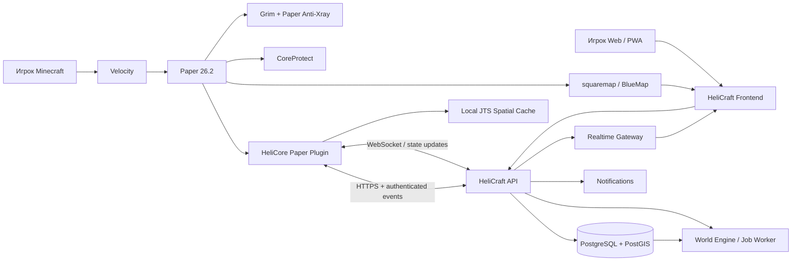
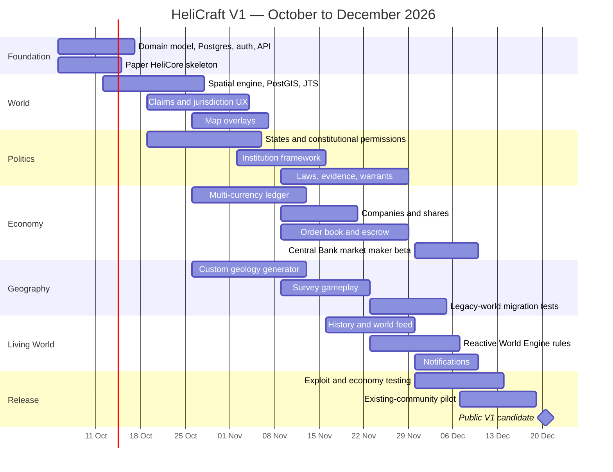
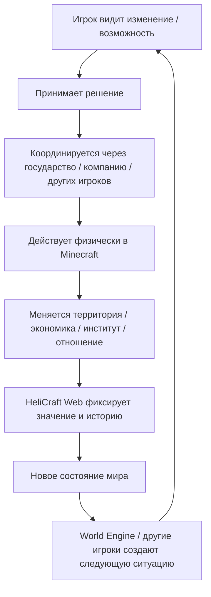

# HeliCraft V1 — Game Design Document и техническо-продуктовое исследование

## Высоковлияющие неизвестные и рабочие допущения

Этот GDD опирается на исходный design snapshot HeliCraft, где ядро сформулировано как persistent social sandbox с переходом endgame от роста силы к росту agency, сайтом как вторым интерфейсом мира, meaningful geography, World Engine и исторической памятью. fileciteturn0file1 Более поздние уточнения считаю приоритетными: обязательные клиентские моды исключаются, ручная административная ратификация признаётся допустимой для редких значимых решений, государства сами инициируют институты, территория отделяется от private claims, а ресурсная география строится вокруг крупных конечных залежей. fileciteturn0file0

Несколько решений всё ещё способны радикально изменить архитектуру. Я не останавливаю GDD вопросами, а фиксирую для них рабочие ответы, которые можно изменить до реализации.

| Открытый вопрос                                                      | Почему он критичен                                                                                                     | Рабочее допущение V1                                                                                                                                                                                                                                                                                             |
| -------------------------------------------------------------------- | ---------------------------------------------------------------------------------------------------------------------- | ---------------------------------------------------------------------------------------------------------------------------------------------------------------------------------------------------------------------------------------------------------------------------------------------------------------- |
| Сколько старой карты уже сгенерировано и сколько богатств накоплено? | Нельзя просто заменить worldgen на persistent-мире и ожидать, что старые чанки перестанут существовать                 | Claimed/исторические чанки никогда не регенерируются. Новая геология действует в новых чанках; unclaimed legacy-чанки можно мигрировать только отдельной административной процедурой                                                                                                                             |
| Что делать с iron/gold farms, villagers и другими renewable sources? | Если железо должно быть геополитически редким, бесконечная iron farm разрушает premise                                 | На старте не делать скрытых nerf'ов. Разделить telemetry по источникам и балансировать только после реального теста. Для первой итерации rich deposits дают **bulk advantage**, а не абсолютную монополию                                                                                                        |
| Можно ли государству экспроприировать private claim?                 | Это конфликтует с другой гарантией: игрок не должен терять дом и месяцы труда                                          | Hard-protected claim в V1 нельзя принудительно передать. Государственный суд может создать долг, lien или юридическое решение, но не удалить техническую защиту постройки без заранее данного/последующего согласия владельца                                                                                    |
| Нужна ли центральная валюта?                                         | Без неё серверу нечем финансировать market-maker reserves; с ней национальные валюты рискуют стать косметическими      | **Нет обычной глобальной валюты.** Для межвалютного клиринга вводится непотребительский `Heli Reserve Unit`, который используется только биржей/ЦБ и не применяется в магазинах, налогах или обычных переводах                                                                                                   |
| Как часто открывается Frontier?                                      | Фиксированный календарь создаст искусственный content treadmill                                                        | Никакой обязательной периодичности. Frontier открывается по состоянию мира и административному решению; первый разумный интервал для проверки — через несколько месяцев, а не через несколько недель                                                                                                             |
| Насколько публичный сервер допускает абсурдный RP?                   | В текущем комьюнити это шутка; после рекламы это становится частью бренда и moderation                                 | Не навязывать реализм, но иметь server-level naming policy: без откровенно сексуальных названий, hate speech, травли и impersonation. Всё остальное — свобода                                                                                                                                                    |
| Война входит в playable V1?                                          | Полноценная война затрагивает PvP, territory transfer, offline protection, destruction, diplomacy и dispute resolution | Архитектура и договор войны проектируются сейчас, но автоматизированная война — **V2/Later**. V1 допускает админ-проводимые mutually agreed wars по заранее зафиксированным условиям                                                                                                                             |
| На какой версии начинать разработку?                                 | Предпочтение «самая свежая» конфликтует со стабильностью plugin ecosystem                                              | На момент исследования официальный download Paper всё ещё указывает 26.2 как текущий релиз, тогда как экосистема уже готовится к 26.3; ядро V1 стоит разрабатывать на стабильной Paper 26.2 и мигрировать после staging-тестов, а не одновременно с разработкой core systems. citeturn12search1turn12search0 |

Самый важный из этих вопросов — **legacy world**. Если внутри будущего border ±10 000 уже сгенерирована почти вся карта и существуют огромные старые склады железа, золота, алмазов и automated farms, ресурсная география не может быть «включена» одним новым генератором. Это потребуется рассматривать как миграцию экономики, а не просто техническую фичу.

## Executive summary и итог исследования

### Главный вывод

Концепция HeliCraft **реально может быть интереснее обычного SMP**, но не потому, что на сервере будут «страны, деньги и биржа». По отдельности всё это давно существует в Minecraft и других multiplayer-играх.

Дифференцирующая конструкция выглядит так:

> **Minecraft даёт физический мир → сайт придаёт ему социальное и юридическое значение → игроки и государства принимают решения → сервер материализует последствия → история сохраняет результат → новое состояние мира создаёт следующие возможности.**

Самая сильная уникальная fantasy HeliCraft поэтому не «геополитический сервер» и не «сервер с реалистичной экономикой», а:

> **двойная игра Minecraft ↔ HeliCraft Web, где действия между двумя интерфейсами действительно меняют один и тот же persistent world.**

Есть хороший внешний precedent: в Eco законодательство, выборы, мировые данные и часть государственного управления уже намеренно вынесены в web interface, при этом сами политические структуры существуют в физическом игровом мире. Eco также связывает правительство с конституциями, законами, налогами, казной, банками и валютами. Это показывает, что связка «физическая multiplayer-игра + серьёзный browser governance layer» может быть естественной, а не обязательно ощущаться внешней админкой. citeturn18search0turn18search17turn18search3 HeliCraft может пойти дальше за счёт множественных государств с различной юрисдикцией, private claims, криминальных evidence events, физически ратифицируемых институтов, скрытой геологии и автоматической исторической летописи.

### Что исследования говорят о retention

Исследования multiplayer-сообществ заметно сильнее поддерживают **социальную составляющую**, чем идею «достаточно построить очень глубокую экономику и люди останутся».

Исследования online-game communities связывают social networks, sense of community и social capital с намерением продолжать играть; в longitudinal-анализе EverQuest II общая guild membership и физическая близость игроков помогали сохранять социальные связи. citeturn2search12turn2search6 Анализ другой крупной игровой социальной сети также обнаруживал связь между локальной социальной структурой и долгосрочной вовлечённостью. citeturn2academia36 При этом принадлежность к guild сама по себе не обязательно ускоряет механический progression — то есть ценность социального слоя не сводится к XP-баффу. citeturn2search2

Это очень хорошо совпадает с исходной философией HeliCraft: **не выдавать +20% production за вступление в государство**, а сделать государство источником людей, решений, ролей, проектов и историй.

Исследования governance online communities тоже предостерегают от попытки автоматизировать и формализовать всё. Анализ десятков тысяч online communities показал, что с созреванием сообществ формальные институты действительно становятся распространённее, но успешные сообщества не обязательно строятся на максимальном количестве жёстких требований; формализация полезна прежде всего для последовательности, прозрачности и легитимности. citeturn2academia34 Исследование Minecraft-сообщества SvinLand в 2026 году также подчёркивает большую роль неформальных механизмов в управлении маленькими городскими группами. citeturn2search7

Отсюда один из центральных design principles V1:

> **формализуем то, где компьютер действительно добавляет ценность; оставляем людям то, где человеческое решение интереснее алгоритма.**

Evidence log стоит формализовать. То, «красив ли парламент», — нет.

### Комьюнити важнее количества механик

Есть и полезная контрточка из самих Minecraft communities. Долгоживущие SMP публично рекламируют себя именно через community-first подход, иногда сознательно **отказываясь от Towny и сложных economy plugins**. SwanCraft в своей публичной презентации подчёркивал community, grief protection и события, одновременно перечисляя отсутствие Towny и economy plugins; отзывы игроков в том же треде чаще хвалят людей и атмосферу, чем механику. Это не научное доказательство причинности, но полезный anecdotal counterexample к идее «больше систем = выше retention». citeturn19search10turn20search2 Аналогично, Perch позиционирует no-reset мир, постоянную обратную связь и ежемесячные мероприятия как часть community experience; комментарии игроков снова концентрируются на дружелюбии и людях. citeturn19search0

Этнографическое исследование Minecraft community отдельно отмечало значимость integrity moderation и отбора/привлечения подходящих участников для формирования просоциальной среды. citeturn2search0

Следствие для HeliCraft особенно важно, поскольку исходная аудитория — друзья и знакомые:

> **не стоит жертвовать культурой высокого доверия ради быстрого публичного роста.**

Реклама на Reddit и в соцсетях должна искать людей, которым нравится именно такой persistent community sandbox, а не максимизировать число случайных joins.

### Что я считаю ядром V1

Для public-ready V1 за 2–3 месяца я рекомендую семь связанных систем:

| Система                                               |                                   Роль в core loop |   Сложность | Главный риск             |
| ----------------------------------------------------- | -------------------------------------------------: | ----------: | ------------------------ |
| Территории, private claims и jurisdiction             |             Делает пространство социально значимым | Medium–High | Edge cases protection    |
| Государства, governance и institution framework       |                           Даёт коллективную agency | Medium–High | Бюрократия               |
| Resource geography + surveying                        | Даёт территории экономическую причину существовать |        High | Farms + legacy world     |
| Laws + evidence + warrants + fines                    |                   Превращает юрисдикцию в gameplay |        High | Abuse силовых полномочий |
| Multi-currency ledger + Central Banks                 | Даёт государствам настоящую экономическую политику |        High | Инфляция/сложность       |
| Order book + companies + share ledger                 |                Создаёт структурированную экономику |        High | Thin market              |
| Web world feed + history + deterministic World Engine |              Отвечает на «что произошло без меня?» |      Medium | Пустой generated content |

**Не рекомендую делать public stock exchange, автоматизированную войну, сложный AI World Engine или полноценную тюрьму частью обязательного V1.**

Это не означает «удалить идеи». Напротив, schema и domain model должны позволять их добавить.

### Самая опасная часть проекта

Не политика.

Не полигоны.

Не сайт.

Самая опасная часть — **экономика**.

EVE Online спустя десятилетия эксплуатации экономики регулярно публикует отдельные отчёты о money faucets, velocity, production, mining, destruction и price indices; в августе 2026 официальный MER снова отслеживал mining value и ценовые индексы. citeturn17search0 В другие месяцы 2026 года CCP фиксировала заметные изменения faucets и mineral price index. citeturn17search2turn17search5 Исследование экономики Old School RuneScape также связывает инфляцию и volatility с качеством пользовательского опыта и подчёркивает ценность постоянного мониторинга ценовых рядов, объёмов и volatility. citeturn2academia35

Отсюда:

> **баланс экономики HeliCraft — не то, что можно «правильно спроектировать один раз». Это управляемая система, требующая telemetry.**

### Самая опасная продуктовая ошибка

Самый вероятный плохой HeliCraft выглядит не как сломанный сервер.

Он выглядит как очень впечатляющий сайт, где есть:

> Currency → Companies → Stocks → Court → Parliament → Laws → Institutions → Statistics

…и в каждом разделе находится по одному человеку.

На сервере с 10 активными игроками сложность интерфейса должна масштабироваться **вниз**. Пустая фондовая биржа хуже отсутствующей фондовой биржи.

## Мир, территория, private claims, ресурсы и Frontier

### Территория и private claims

**Fantasy.** Игрок должен ощущать, что география сервера имеет настоящую политическую структуру: переход через реку может означать переход в другую юрисдикцию, а дом остаётся его домом независимо от того, кто покрасил регион на политической карте.

**Player loop.**

```text
исследую место
    ↓
строю / создаю claim
    ↓
вокруг меня появляется поселение или государство
    ↓
решаю: присоединяться или оставаться независимым
    ↓
территориальная карта меняется
    ↓
новая юрисдикция влияет на мои социальные и правовые возможности
```

**Exact mechanics.**

HeliCraft должен иметь две независимые spatial-модели.

`Jurisdiction polygon` отвечает на вопрос:

> чьи государственные законы здесь действуют?

`Protection claim` отвечает:

> кто может физически изменять эти блоки?

Это не один объект.

Государство хранится как `Polygon / MultiPolygon` в X/Z, включая holes. Именно hole позволяет корректно представить ситуацию:

> Aurora окружила дом независимого игрока → игрок не согласился на аннексию → внутри Aurora остаётся независимый enclave.

Первоначальное государство может основать один игрок. Для регистрации нужны:

1. фактическая постройка столицы;
2. Government Hall/City Hall;
3. заявка на сайте;
4. proposed initial polygon;
5. отсутствие неразрешённого поглощения чужих private claims;
6. административная ратификация.

Не требуется искусственный minimum citizens: на маленьком сервере это прежде всего стимулировало бы статистов и alt accounts.

Для V1 я бы задал не сложную формулу territory score, а административно-технические constraints:

| Ограничение                                 | V1                                                                      |
| ------------------------------------------- | ----------------------------------------------------------------------- |
| Polygon должен быть valid                   | обязательно                                                             |
| Пересечения с другим state territory        | запрещены без treaty                                                    |
| Независимый private claim внутри annexation | требует explicit consent                                                |
| Ненормально узкие «щупальца»                | отклоняются                                                             |
| Обычное расширение                          | соседняя территория                                                     |
| Colony/enclave                              | отдельная специальная заявка                                            |
| Expansion cooldown                          | примерно 7 дней, настраиваемо                                           |
| Причина расширения                          | settlement / project / physical presence / treaty / resource concession |
| Финальное решение                           | ratification администрацией                                             |

Число вроде «минимум 64 блока ширины» не должно становиться священным законом: люди просто научатся рисовать коридор ровно 64 блока. Shape validation отсекает технический мусор, а человеческая проверка решает смысл.

Private claim независимого игрока вне государств выдаётся с ограниченным стартовым budget площади. Внутри государства земельный режим определяется его системой участков, но сама техническая защита всё равно опирается на HeliCore.

**Важное изменение относительно идеи принудительной экспроприации:** государство может юридически вынести решение об экспроприации, но V1 не должен автоматически удалять private hard protection. В permanent world потеря месячного дома является значительно более сильным наказанием, чем потеря денег или должности. Юридический результат может быть lien, долг, запрет продажи, предложение обязательного выкупа или предмет appeal; физическая передача требует заранее оговорённой процедуры.

**Minecraft UX.** Никаких обязательных `/town claim`. При crossing jurisdiction:

```text
AURORA
Restricted border

PvP prohibited · Entry permit required
```

При выходе:

```text
Leaving Aurora
Entering Wilderness
```

Команда/предмет `Borders` временно показывает ближайшую линию частиц. Private claim отображается actionbar при попытке взаимодействия и может иметь краткий `/land inspect`.

Paper позволяет отменять block interaction events вроде `BlockBreakEvent`, так что hard protection можно реализовывать server-side без клиента. citeturn1search0 Однако high-frequency события нельзя превращать в сетевые запросы к backend; сам Paper отдельно предупреждает, что некоторые block/physics events вызываются крайне часто. citeturn1search11 Поэтому spatial authorization должна работать из локального cache плагина.

**Web UX.** Политическая карта — primary editor сложной геометрии. Игрок выбирает слой:

`Political / Private property / Institutions / Resources I know / Companies / History`.

При заявке территория рисуется на карте, а интерфейс сразу показывает conflicts и required consents.

**Abuse cases.** Щупальца до deposits, окружение чужого дома, polygon с тысячами вершин, enclave spam, попытка использовать piston/liquid/explosion для обхода claim, state admin abuse.

**Small-server stress test.** При 10 игроках manual ratification предпочтительнее алгоритма «по 37 чанков на гражданина»: заявок будет мало, а политическая цена каждого изменения высока. Formal governance полезна для прозрачности, но исследования небольших communities показывают, что неформальные механизмы остаются особенно важны в небольших группах. citeturn2academia34turn2search7

**Technical implementation.** Authoritative polygons — PostgreSQL/PostGIS. PostGIS имеет стандартные spatial predicates вроде `ST_Contains` и использует bounding-box/index-assisted проверки. citeturn14search6 На Minecraft-side geometry кэшируется через JTS; `STRtree` предназначен для 2D spatial indexing, а `IndexedPointInAreaLocator` оптимизирован именно под многократные point-in-area queries и является thread-safe. citeturn14search0turn14search4

Таким образом:

```text
DB/PostGIS = authority + editing + validation
JTS in Paper plugin = fast runtime jurisdiction lookup
```

**Admin workload.** Низкий в повседневности; средний при редких expansions. Ориентир: 15–30 минут на нормальную заявку, почти ноль между заявками.

**Risks.** Protection edge cases — один из тех компонентов, где один bypass способен разрушить доверие к серверу.

**Recommendation.** **V1 Core.**

### Resource geography и surveying

**Fantasy.**

Игрок не видит на wiki, где расположено всё ценное.

Он физически отправляется в мир с survey instrument:

> делает замеры → понимает геологию → скрывает или продаёт информацию → государство/компания решает, что с ней делать.

Результат может быть:

> «Мы нашли крупнейшую медную залежь сезона».

Это уже история.

**Exact mechanics.**

Я рекомендую скрытую `Geology Layer`, независимую от обычного Minecraft seed.

При генерации мира сервер создаёт набор deposits:

```text
Deposit
id
resource_type
geometry_3d
grade
estimated_volume
secret_seed
discovered_by[]
ownership/legal metadata
```

Физически deposit — это реальные vanilla ore blocks, просто значительно крупнее обычной vein.

Типичный rich deposit должен быть не «медь ×3», а **реально узнаваемым промышленным телом**, которое приятно обнаружить в шахте.

Например, не финальные числа:

| Класс       |        Масштаб | Роль                       |
| ----------- | -------------: | -------------------------- |
| Trace       | десятки блоков | обычное местное сырьё      |
| Local       |          сотни | частная добыча             |
| Rich        |         тысячи | коммерческая добыча        |
| Exceptional |  многие тысячи | стратегический объект мира |

Точные числа нельзя фиксировать до telemetry по реальной скорости mining.

Deposit конечный. После добычи он не respawn'ится.

**Survey instrument.** Лучше использовать обычный предмет, например modified compass/spyglass, помеченный Paper Persistent Data Container. PDC официально предназначен для хранения custom metadata на поддерживаемых игровых объектах, не требуя abuse lore/NBT. citeturn0search12

Right click:

```text
Surveying...
Radius: 64 blocks

Copper signature: HIGH
Iron signature: TRACE
Gold signature: NONE

Confidence: 63%
```

Игрок не получает координату центра.

Несколько замеров позволяют примерно локализовать залежь.

Результат по умолчанию **private**. Игрок может:

> сохранить его себе;  
> поделиться с компанией;  
> передать государству;  
> продать dataset;  
> опубликовать.

Общий web-map не раскрывает deposit автоматически.

**Minecraft UX.** Исследование — физическое. Site нужен после него для управления информацией, а не вместо него.

**Web UX.** Личный слой `My Survey Data`, team/company layer, history of measurements. Продажа geological report передаёт именно dataset, а не публично раскрывает его всему миру.

**Abuse cases.**

Главный exploit — X-ray/seed discovery. Paper включает собственный obfuscation Anti-Xray с несколькими engine modes; документация прямо объясняет, что deterministic world generation и утечка seed являются отдельным attack vector, а Anti-Xray сам по себе не является абсолютной защитой. citeturn21search0 Поэтому Heli deposit seed должен быть отдельным секретом, который **не выводится из vanilla world seed**.

Для движения/cheat detection можно использовать отдельный anti-cheat; актуальный Grim поддерживает современные Paper-серверы вплоть до Minecraft 26.3 и строит проверки на server-side simulation. citeturn15search18

Но никакая техническая защита не должна заменять policy: X-ray, seed crackers и автоматическое mining должны явно считаться запрещёнными.

**Серьёзная проблема vanilla farms.**

Вот здесь исходную идею нужно чуть «сломать реальностью».

Если:

> iron исключительно важен из-за географии,

но одновременно разрешена мощная iron farm,

тогда location iron ore перестаёт определять bulk iron supply.

Нельзя одновременно обещать «vanilla farms без изменений» и «все ресурсы контролируются геологией» и ожидать полного выполнения обоих условий.

Я рекомендую V1:

> **не делать скрытые nerf'ы.**

Сначала собрать telemetry:

```text
iron acquired by natural mining
iron acquired in registered deposits
iron generated by farms
iron traded
iron stored
```

Если через месяц 80% circulating iron идёт с farms, принимается публичное balancing decision.

Скрытый nerf особенно вреден HeliCraft: сервер пытается построить мир законов и доверия, а его собственные правила не должны быть непредсказуемыми.

**Legacy world.** Это High-risk migration.

Никогда автоматически не регенерировать claimed/исторические chunks.

Практичная стратегия:

```text
OLD CORE WORLD
vanilla-ish legacy geology
        +
NEW/UNGENERATED REGIONS
Heli geology with very rich deposits
```

Тогда старый мир остаётся комфортным для личного Minecraft progression, а крупномасштабная экономика постепенно смещается к новым богатым зонам.

Это фактически даёт **реальное назначение первому Frontier**.

**Small-server stress test.** Геология работает даже при одном игроке онлайн. Multiplayer появляется через ownership, secrets, trade и territorial interest. Это хороший признак.

**Technical implementation.** Paper предоставляет `ChunkGenerator` API, позволяющий кастомизировать стадии world generation и при необходимости делегировать часть стадий vanilla generator; документация отдельно требует учитывать thread-safety. citeturn1search7 Можно также использовать data pack path, но Paper data-pack lifecycle всё ещё имеет экспериментальные части, поэтому core geological registry разумнее держать в собственном plugin/domain layer. citeturn0search9

**Admin workload.** После настройки worldgen почти нулевой; ручная работа нужна только для balance revisions и спорных ownership cases.

**Risks.** Legacy stockpiles, farms, X-ray, слишком большие deposits, случайная географическая сверхмонополия.

**Recommendation.** **V1 Core, но запускать сначала как экспериментальную экономическую систему с telemetry.**

### Frontier

Твоя интуиция здесь верная:

> «Мы открыли ещё 2000 блоков земли» — **само по себе почти не является контентом**.

Frontier не должен считаться core gameplay feature.

Он должен считаться **инструментом против saturation и способом выпускать persistent content без wipe**.

Хороший Frontier обладает одновременно несколькими свойствами:

```text
new land
+ new unknown geology
+ unclaimed political space
+ actual event
+ uncertain information
+ opportunities not already owned
```

Плохой Frontier:

```text
worldborder += 2000
```

**Player loop.**

```text
announcement
→ social opening event
→ exploration/survey
→ information asymmetry
→ settlements/projects
→ negotiations over territory
→ permanent incorporation into normal world
```

**Exact mechanics.**

Не использовать фиксированный «каждые три месяца».

Администраторы смотрят на:

> saturation старой территории;  
> доступность meaningful unclaimed land;  
> depletion богатых deposits;  
> рыночное состояние;  
> состояние новичков;  
> желание сообщества получить новое пространство.

Открывается не весь огромный ring одновременно, а **отдельный сектор/регион**. Иначе veteran на элитрах за вечер превращает world expansion в один большой reconnaissance pass.

Рекомендую две фазы:

`Survey Phase`, 48–72 часа: государственные annexation applications закрыты; exploration разрешён.

`Settlement Phase`: открываются private claims и государственные territorial applications по обычным правилам.

Это не гарантирует новичку победу и не запрещает veteran играть, но не позволяет одной стране за первые десять минут юридически забрать весь регион.

**Minecraft UX.** Frontier должен быть physical launch: открытая граница, expedition point, новые координаты, люди реально летят/идут туда.

**Web UX.** Отдельная temporary event layer, progress of discoveries, published landmarks и history.

**Abuse cases.** Elytra speedrun, chunk pre-generation leaks, alt scouting, instant territorial painting.

**Small-server test.** Frontier полезен только если открытие способно собрать значительную долю ваших 10–20 игроков. Если в нём нет необычной возможности, лучше вообще не проводить.

**Technical implementation.** Фактический доступ можно контролировать собственным allowed-region polygon, а не только vanilla rectangular border. Locked chunks заранее генерировать не обязательно; это дополнительно уменьшает accidental leakage.

**Admin workload.** Средний, но очень редкий: это authored world event.

**Risks.** Feature становится предсказуемым reset-without-reset и через второй-третий раз теряет novelty.

**Recommendation.** **V2 / operational tool**, кроме случая, когда первый Frontier нужен именно для миграции existing world на новую геологию.

### Nether и End

Для V1 я рекомендую максимально понятную модель:

> **Overworld — суверенная политическая территория. Nether и End — international commons.**

State jurisdiction там не распространяется.

Private safety claims для важных portal hubs/строений разрешены.

При выходе из Nether portal внутрь закрытой Aurora событие считается **входом в Aurora** ровно так же, как пересечение наземной границы:

```text
Nether commons
     ↓ portal
Aurora restricted jurisdiction
     ↓
border warning / trespass logic
```

Таким образом Nether не является loophole закона.

Не нужно ломать vanilla 1:8 travel только для поддержания воображаемой таможни.

Позже государства смогут создавать Nether concessions/colonies, если игроки реально захотят политизировать измерение.

## Государства, governance, институты, законодательство и конфликт

### Государство и конституция

**Fantasy.**

Государство — не «гильдия с цветом».

Это коллективный actor, способный:

> принимать законы;  
> владеть treasury;  
> выпускать валюту;  
> создавать институты;  
> заключать договоры;  
> распоряжаться государственной территорией;  
> создавать роли и процедуры.

Eco — особенно полезный сравнительный пример: его government system поддерживает конституционные процедуры, выборы, laws, taxes и разные модели власти; документация прямо предупреждает, что небольшие игровые общества отличаются от реальных государств, поскольку игроки имеют внешнюю жизнь и всегда могут просто уйти. citeturn18search0 Это именно та причина, по которой HeliCraft нельзя превращать в юридический симулятор.

**Exact mechanics.**

Не стоит кодировать:

```text
government_type ENUM:
DEMOCRACY
MONARCHY
DICTATORSHIP
```

как жёсткие механики.

Лучше сделать **constitutional primitives**.

Государственные действия:

| Action             | Примеры возможной authority policy            |
| ------------------ | --------------------------------------------- |
| Change law         | ruler / parliament vote / citizen referendum  |
| Spend treasury     | finance minister / ruler / 2-of-3 council     |
| Issue currency     | central bank governor / ruler + governor      |
| Change border      | ruler / referendum / council                  |
| Create institution | government office / parliament                |
| Appoint office     | ruler / election / council                    |
| Accept war         | ruler + referendum / parliament supermajority |
| Treaty             | foreign minister / ruler / vote               |

А затем предложить presets:

`Autocracy`, `Constitutional Monarchy`, `Council Republic`, `Direct Democracy`.

Preset только заполняет настройки. Государство может его изменить.

Так HeliCraft поддерживает и абсолютного монарха, и сложную демократию без написания четырёх отдельных systems.

**Freeform constitution** существует рядом и объясняет нормы, которые engine не понимает.

**Succession.**

Каждая critical office обязана иметь fallback:

```text
named successor
OR council appointment
OR election
OR administrator emergency procedure
```

После configurable inactivity срока система не должна автоматически «свергать» человека. Она создаёт:

> `Leadership inactive — succession process may be initiated`.

Это важно для друзей, которые могут просто уехать на неделю.

**Minecraft UX.** Никаких `/nation set-president`. Редкие ceremonial actions могут требовать присутствия в Government Hall.

**Web UX.** Это один из главных экранов HeliCraft: constitution, offices, citizens, proposals, decisions, laws, treasury, institutions и history.

**Abuse cases.** Конституция, которую ruler мгновенно меняет перед controversial decision; succession lock; invite-spam; alt voting.

Решение — versioned constitution. Изменение rules itself проходит старую procedure до момента вступления новой версии в силу.

**Small-server stress test.** Государство из одного человека работает: все authorities просто находятся у него. При двух-трёх людях можно иметь king + minister. Не требуется искусственно изображать парламент из семи NPC-ролей.

**Technical implementation.** Authorization engine как generic policy evaluator:

```text
ActionRequest
→ applicable constitution version
→ AuthorityPolicy
→ approvals/vote/signatures
→ committed DomainEvent
```

**Admin workload.** Практически нулевой после foundation, кроме emergency succession/abuse.

**Risks.** UI complexity.

**Recommendation.** **V1 Core.**

### Институциональные здания

Это одна из наиболее сильных частей концепции.

**Fantasy.**

> «Центральный банк Aurora существует не потому, что в меню активирован checkbox, а потому что в Minecraft действительно существует Центральный банк Aurora».

Eco показывает похожий design principle: banks, Mint и государственные civic structures являются физическими game objects, а экономика и government работают вокруг них. citeturn18search1turn16search5

Но HeliCraft не должен превращать это в `Tech Tree`.

**Exact mechanics.**

Процесс:

```text
государство принимает политическое решение
        ↓
создаёт physical building
        ↓
подаёт Institution Application
        ↓
администратор проверяет минимальные functional requirements
        ↓
отмечает functional blocks / region
        ↓
institution RATIFIED
        ↓
capability становится active
```

Institution Region — cuboid, как ты предложил.

Администратор не ставит архитектуре `7/10`.

Он проверяет:

> здание реально существует;  
> это не dirt box exploit;  
> обязательные functional areas/blocks присутствуют;  
> заявленная функция понятна.

Каждый ratification создаёт публичный event:

```text
Central Bank of Aurora
RATIFIED
12 December 2026

Approved by: Admin Council
Decision record: ...
```

Если marked functional blocks destroyed:

```text
ACTIVE
→ DEGRADED
→ SUSPENDED
```

Не все capabilities должны мгновенно исчезать. Например existing money не уничтожается при разрушении банка.

ЦБ может потерять:

> mint new currency;  
> change monetary policy;  
> modify market-maker settings.

Но existing balances и ongoing trades остаются безопасными.

После ремонта:

> `Request re-inspection`.

**Recommended V1 institutions.**

| Institution     | V1 функция                                  | Рекомендация                                 |
| --------------- | ------------------------------------------- | -------------------------------------------- |
| Government Hall | existence/governance государства            | V1 mandatory                                 |
| Police Station  | execute warrant/fine/custody                | V1                                           |
| Central Bank    | currency issuance + policy + reserve bot    | V1                                           |
| Court           | cases, judgments, appeal record             | V1-lite                                      |
| Parliament      | ceremonial location + voting governance     | V2; governance itself already works          |
| Exchange        | physical commodity deposit/withdrawal point | V1 shared exchange; national exchanges later |
| City Hall       | local settlement administration             | V2                                           |

**Minecraft UX.** Нужны отмеченные функциональные blocks, а не custom-model furniture. Например администратор инструментом кликает по lectern/chest/bell/table locations и регистрирует их роли.

**Web UX.** Institution page:

> location;  
> operating state;  
> officials;  
> capabilities;  
> founding date;  
> physical map location;  
> history;  
> suspension reason.

**Abuse cases.** Семь box buildings; убрать required block после approval; перенести здание; overlapping institutions.

**Small-server test.** Institution важен даже при одном citizen, если у него есть real capability. Нельзя требовать наличие employee count.

**Implementation effort.** Medium.

**Admin workload.** Несколько минут на редкую инспекцию.

**Recommendation.** **Institution framework — V1 Core.**

### Laws, immutable evidence, warrants и arrest

Здесь я считаю исходную трёхслойную модель правильной:

```text
SERVER SAFETY
hard protection / bans
        ↓
MACHINE-READABLE STATE LAW
can be violated; server records facts
        ↓
FREEFORM STATE LAW
humans interpret
```

Eco сегодня в основном реализует laws как prevention rules; официальная документация описывает law clauses вроде `Prevent Action`. citeturn18search9 Именно здесь HeliCraft способен сделать нечто более интересное:

> **не запрещать всякое незаконное действие технически, а позволять нарушению стать multiplayer event.**

**V1 machine-readable law vocabulary** нужно держать маленьким.

| Law domain                 | Машина понимает                        |
| -------------------------- | -------------------------------------- |
| Border                     | Open / Notify / Restricted             |
| Foreign entry              | public / whitelist / forbidden persons |
| PvP                        | Allowed / Restricted / Prohibited      |
| Government restricted zone | authorized roles                       |
| Taxes                      | formal rates / liable accounts         |
| Persona non grata          | list + entry violation                 |
| Warrants                   | active / executable / expired          |

Не надо пытаться V1 автоматически понимать:

> architectural code;  
> slander;  
> espionage;  
> constitutional treason;  
> breach of an unusual treaty.

Это freeform law + human court.

**Evidence model.**

Система никогда не пишет:

> `Maksim committed murder`.

Она пишет facts:

```text
CombatEvent #7b...
timestamp
attacker
victim
world
x/y/z
jurisdiction_id
law_revision_id
damage
weapon
fatal=false

CombatEvent #7c...
...
fatal=true
```

Суд решает legal meaning.

Это позволяет нормально трактовать self-defense.

Для combat session сохраняются:

> initial aggressor;  
> attacks;  
> damage sequence;  
> deaths;  
> jurisdiction transitions.

Закон сохраняется **по версии, действовавшей в момент факта**.

Новый закон никогда не меняет старое evidence.

**Restricted border.**

При entry:

```text
WARNING
You are entering restricted territory of Aurora.
Turn back within 12 seconds.
```

Если игрок разворачивается — преступления нет.

Если остаётся:

```text
BorderViolationEvent
```

Один continuous visit = одно нарушение, а не 10 events в секунду.

**Warrant.**

Court/authorized office из evidence создаёт:

```text
Warrant
suspect
jurisdiction
charges
evidence_refs[]
issuer
created_at
expires_at
authorized_penalty_range
```

Warrant не даёт полиции права на arbitrary players.

**Arrest mechanic.**

Я бы не делал ни `/arrest Maksim`, ни необходимость победить suspect в PvP.

Твоя идея специального предмета работает, если добавить constraints.

Officer получает обычный vanilla item с PDC-tag, например `Police Baton`.

Чтобы задержание началось:

```text
active executable warrant
+ officer has police authority
+ both inside state's jurisdiction
+ distance <= ~3 blocks
+ line of sight
```

Right click запускает короткий `Detain channel`.

Suspect видит:

> `Officer X is attempting to detain you`.

Он может убежать.

Через примерно 2 секунды непрерывной близости custody succeeds.

После этого **не нужно заставлять игрока пять минут идти связанным по дороге**. Оба получают короткую transition sequence и suspect переносится в registered Police Station processing point.

Это сохраняет:

> поиск + погоню + физическое присутствие,

но убирает:

> «теперь сиди 30 минут и ничего не делай».

Если suspect disconnects после начала valid detain channel, custody сохраняется и завершается при следующем join. До начала detainment обычный logout не считается автоматической виной.

**Punishment.**

Основное наказание — экономико-социальное:

> fine;  
> debt;  
> restitution;  
> license revocation;  
> persona non grata;  
> office removal;  
> court record.

Не real-time jail.

Если денег нет, игрок не получает:

> `You cannot play for three hours`.

Создаётся debt.

Safety floor означает, что debt не может отнять защищённый дом или базовые предметы.

**Freeform law.**

Администрация **не гарантирует исполнение каждого локального закона**.

Это должно быть явно написано:

> machine-readable rules receive system evidence/enforcement; freeform rules are subject to state institutions and voluntary/admin arbitration.

Иначе server staff превращается в Supreme Court каждой ссоры.

**Web UX.** Court docket, evidence timeline, warrant list, decisions, appeals.

**Abuse cases.**

Самая опасная категория — police grief:

> ruler выписывает warrant всем;  
> police repeatedly detains foreign visitor;  
> fine intentionally impossible.

Поэтому warrant issue и maximum machine sanctions должны быть видимы в constitution и audit trail. Appeal существует всегда хотя бы на server-administration level.

**Small-server test.** Судья может быть ruler. Не нужен mandatory jury. Court case остаётся asynchronous web object, поэтому не требует всех людей онлайн одновременно.

**Technical implementation.** Evidence — append-only domain log, а не CoreProtect lookup. CoreProtect полезен параллельно как forensic/rollback tool: его официальный API позволяет логировать custom block changes, делать lookups, rollback и restore. citeturn15search1 Но criminal evidence HeliCraft должен иметь собственную schema, чтобы хранить law revision и semantic context.

**Admin workload.** В норме low; спорные appeals могут быть high. Это одна из причин не автоматизировать десятки типов преступлений.

**Risks.** Abuse authority, confusing rules, logout exploits, players feeling arbitrarily punished.

**Recommendation.** **V1 Core, но только 3–5 machine-readable offence classes.**

### War

Война в HeliCraft должна быть не state of nature, а **contractual exceptional mode**.

```text
War Contract
participants
allowed combatants
start time
end conditions
PvP rules
institution destruction rules
eligible state territory
territory at stake
private claims protected
surrender conditions
admin arbitration
```

Обе стороны должны провести свою constitutional ratification.

После этого contract получает explicit `ACCEPTED`.

Только тогда server changes rules.

Это отлично соответствует твоей цели:

> territorial loss возможен, но никто не просыпается внезапно уничтоженным.

Towny SiegeWar показывает, что автоматизированные siege/capture systems для Minecraft технически вполне реализуемы, включая money/territory stakes и protection buildings, но его premise — регулярная geopolitical warfare поверх Towny — заметно отличается от редкой добровольной войны HeliCraft. citeturn9search0 Поэтому интегрировать SiegeWar как core я бы не стал.

Private claims остаются hard-protected даже во время войны.

Институциональные объекты могут стать legitimate objectives **только если War Contract это явно разрешает**.

Возможный negotiated outcome:

> state territory transferred;  
> reparations;  
> institution suspended/destroyed;  
> state dissolved;  
> protectorate treaty.

**Recommendation.** **Later.** Для V1 достаточно data model + возможность администрации провести специальную войну вручную по подписанному web-contract.

### Onboarding

Первый spawn я бы не отдавал ни случайной Aurora, ни совершенно случайной wilderness.

Лучше:

> **Neutral Arrival Zone** — небольшая server jurisdiction.

Там действуют только server rules.

При первом входе сайт и игра предлагают:

```text
Explore independently
Visit Aurora
Visit Helia
Choose wilderness starting region
```

Игрок получает **один onboarding relocation**, а не постоянный `/tpa`.

Он сознательно соглашается на государственные законы только при membership/settlement.

State recruitment отображается на сайте, но государство не может спамить newcomer двадцатью invitations.

Для border crime всегда действует warning/grace period.

Это особенно важно, потому что HeliCraft не должен учить новичка своей уникальной системе через:

> «Поздравляем, вы случайно стали преступником».

## Экономика, национальные валюты, компании, рынок и World Engine

### Денежная архитектура

Самое важное решение:

> **не делать обычный HC$**, которым автоматически измеряется всё.

Если национальная AUR существует рядом с безопасным и принимаемым везде HC$, рациональный игрок очень быстро спросит:

> «Зачем мне вообще AUR?»

Eco показывает, что multiple currencies и даже resource-backed currencies способны быть частью player government/economy: официальный wiki описывает как player credit, так и minted currencies, для которых mint выбирает backing resource; government может также ограничивать разрешённые валюты. citeturn18search3turn18search15

Но HeliCraft не стоит копировать resource backing как обязательную модель.

**National currency lifecycle.**

После ratification Central Bank:

```text
Create Currency
name: Aurora Crown
ticker: AUR
minor units: 2
issuer: Central Bank of Aurora
initial supply: 0
```

ЦБ получает authority:

> mint;  
> burn;  
> transfer newly issued money to treasury;  
> configure market maker;  
> inspect monetary statistics.

Эмиссия ничем автоматически не ограничивается.

Хочет Aurora напечатать миллиард AUR?

Может.

И это должно быть **настоящим player decision**.

UI показывает:

```text
AUR Money Supply
30d: +470%

Treasury issuance:
+1,000,000 AUR

Circulation:
1,231,822 AUR
```

Люди сами могут решить перестать принимать валюту.

Но сервер не должен притворяться полноценным макроэкономическим симулятором. При 10–30 игроках «CPI Aurora» легко становится шумом. Полезнее начать с объективных operational metrics:

> total supply;  
> active balances;  
> velocity proxy;  
> transaction volume;  
> exchange price;  
> spread;  
> reserve level;  
> concentration.

EVE официально отслеживает money supply, faucets, production/mining/destruction and price indices, что является хорошим примером того, насколько важнее economy observability, чем попытка заранее выбрать идеальную денежную массу. citeturn17search4turn17search15

**Создание спроса.**

Государство может устанавливать:

> taxes paid in AUR;  
> public salaries in AUR;  
> public procurement in AUR;  
> state land lease in AUR;  
> licenses/fees in AUR.

Это принципиально важнее искусственного:

> `AUR grants +5% mining`.

Государство создаёт demand собственной деятельностью.

### Проблема server-provided reserves

Здесь появляется логическое противоречие.

Если сервер выдаёт Central Bank «резервы», то **что именно он выдаёт?**

Если HC$ — мы всё-таки создали глобальную валюту.

Если HEL — сервер подделывает чужую национальную валюту.

Если diamonds — сервер становится генератором реальных commodities.

Поэтому я рекомендую специальный технический asset:

> **Heli Reserve Unit — HRU.**

Это **не обычные деньги**.

Игрок не может:

> `/pay HRU`;  
> купить дом за HRU;  
> поставить налог в HRU;  
> заплатить в магазине HRU.

HRU существует только на Foreign Exchange.

Например:

```text
AUR / HRU
HEL / HRU
```

Игрок может временно иметь HRU exchange balance и использовать его только для покупки других currencies.

Это фактически settlement asset наподобие clearing unit, а не general-purpose money.

Server выдаёт новому ратифицированному ЦБ ограниченный reserve:

```text
Aurora CB Reserve:
10,000 HRU
```

И **никогда не даёт bot бесконечный reserve**.

### Central Bank market maker

ЦБ определяет:

```text
Target rate: 1.00 HRU/AUR
Bid: 0.95
Ask: 1.05
Max order size: 100 AUR
Daily reserve budget: 800 HRU
Reserve floor: 1,500 HRU
```

Bot выставляет реальные orders.

Если люди массово продают AUR:

> bot тратит HRU reserve.

Reserve заканчивается:

> buy-side liquidity исчезает.

Это не exploit.

Это означает:

> Aurora больше не способна защищать курс.

При этом bot **никогда не может уйти в отрицательный reserve**.

Чтобы плохо настроенный бот не стал бесплатной arbitrage machine, нужны:

> atomic order settlement;  
> finite inventory;  
> maximum quote size;  
> configurable spread;  
> circuit breaker;  
> no negative balances;  
> cooldown after extreme price move.

Исследование adaptive trading agents на данных MMO/EVE показывает, что автоматизированные торговые агенты сами способны получать конкурентное преимущество; это хороший аргумент против «умного AI trader», который торгует от лица сервера. citeturn2search4

Heli bots должны быть максимально тупыми и прозрачными:

> deterministic market makers, а не traders.

**Fantasy.**

Если президент печатает слишком много денег и банк сжигает reserve, результатом может стать:

> monetary crisis.

Это уже настоящее player-generated event.

**Но сервер не должен специально устраивать hyperinflation.**

### Ledger

Multi-currency — одна из областей, где я настоятельно рекомендую **не строить core на Vault**. В официальном VaultAPI до сих пор существует открытый запрос на полноценную multi-currency поддержку, что хорошо отражает несовпадение старой абстракции Vault с вашей моделью. citeturn15search9

Authoritative ledger должен быть Heli-owned.

```text
Account
  player
  company
  state treasury
  central bank
  exchange escrow

Asset
  AUR
  HEL
  HRU
  company share

Transaction
  immutable

Posting
  account
  asset
  delta
```

Деньги — integer minor units, не floating-point.

Любая transfer операция атомарна.

Issuance тоже является transaction:

```text
Central Bank issuance account -1000 AUR
State Treasury             +1000 AUR
```

Это позволяет всегда объяснить:

> откуда появились деньги.

PostgreSQL предоставляет `SERIALIZABLE` isolation, при котором успешно committed concurrent transactions должны иметь эффект, согласующийся с некоторым последовательным выполнением; документация также требует корректно retry serialization failures. citeturn13search0turn13search1 Это хорошо подходит для balance-critical операций. Advisory locks можно использовать для application-defined resources вроде конкретной market pair. citeturn13search7

**Recommendation.** **Currency + ledger V1 Core; HRU и automated market maker V1 Beta/feature flag.**

### Order-book marketplace

Order book — хорошая идея, но его scope нужно ограничить.

Не всё является fungible asset.

Плохо пытаться запихнуть в один matching engine:

> 64 iron;  
> участок возле столицы;  
> строительство собора;  
> один час работы архитектора.

Поэтому:

```text
ORDER BOOK
fungible assets

LISTINGS / CONTRACTS
heterogeneous things
```

**V1 order-book assets:**

> currencies;  
> standardized vanilla commodities;  
> позже company shares.

**V1 listing assets:**

> land;  
> contracts;  
> services;  
> unique items.

**Exact order mechanics.**

```text
BUY 100 IRON @ 3.20 AUR
SELL 50 IRON @ 3.10 AUR
```

Matching:

> price priority → time priority.

Sell order невозможен, пока commodity не находится в escrow.

Это важно.

Иначе:

> игрок выставил 10 000 iron → потратил его → ушёл offline → buy order невозможно выполнить.

Поэтому physical Exchange имеет warehouse blocks.

Игрок приносит iron в Minecraft:

```text
Exchange Deposit
+512 IRON
```

И только после этого website позволяет поставить sell order.

После покупки товар становится exchange inventory покупателя.

Чтобы вынести его в физический мир:

> прийти в Exchange/authorized warehouse → withdraw.

Вот это отличный пример **Minecraft ↔ Website loop**:

```text
Minecraft: physical goods
        ↓
Exchange warehouse
        ↓
Website: price discovery / orders
        ↓
Ledger settles trade
        ↓
Minecraft: physical withdrawal
```

Частые финансовые действия удобно делать с сайта.

Физическое присутствие требуется на boundaries между digital ownership и Minecraft item ownership.

**Small-market problem.**

На сервере из десяти человек реальный order book может выглядеть:

```text
IRON/AUR
Bid —
Ask —
```

Minecraft server admins давно обсуждают ту же проблему: полностью player-driven market привлекателен, но economy нужен реальный incentive, а бесконечные admin shops легко подавляют price discovery или создают inflation. Это anecdotal evidence, но проблема повторяется в разных сообществах. citeturn19search1turn19search12

Именно поэтому limited market-maker имеет смысл прежде всего **для currency markets**, но не стоит заставлять server-bot автоматически покупать каждый стак железа.

**Не создавать `/sell iron` в сервер.**

Иначе geology → automated farm → server sink превращается в machine for printing money.

**Web UX.**

Не имитировать Bloomberg terminal.

Обычный игрок сначала видит:

> best price;  
> buy;  
> sell;  
> recent trades.

Depth chart/order book можно спрятать в Advanced.

**Abuse.**

Wash trading, fake volume, price manipulation, self-trading, bot arbitrage, item metadata exploits, race conditions, integer overflow.

Self-trading можно запретить на matcher level.

Но не надо пытаться запретить любую price manipulation. В маленьком рынке она частично является самой экономикой.

**Technical implementation.**

Каждый market pair имеет matching worker.

```text
place order
→ lock/serializable transaction
→ escrow validation
→ match orders
→ ledger postings
→ commit
→ websocket market update
```

No negative escrow.

Каждый request имеет idempotency key.

**Admin workload.** Низкий после стабилизации, но первые недели требуют анализа telemetry.

**Risk.** High.

**Recommendation.** **V1 Core, но только commodity/currency trading.**

### Companies и shares

**Fantasy.**

Компания — отдельный actor мира, а не chat clan.

Она имеет:

> owners;  
> shares;  
> treasury;  
> employees/roles;  
> claims;  
> contracts;  
> history.

**V1 mechanics.**

Company:

```text
name
registered jurisdiction
registered office
treasury accounts
roles
authorized shares
issued shares
shareholders
owned claims
```

Shares — integer units.

Например:

```text
Authorized: 1,000,000
Issued: 100,000

Maksim        60,000
Alex          30,000
Aurora State  10,000
```

Share issuance — corporate decision.

Transfer — ledger event.

Dividend — optional distribution transaction.

Компания может владеть claim и account как entity.

**Но публичную фондовую биржу я не рекомендую в V1.**

На 10 активных игроках:

> 3 компании × 2 shareholders

не создают stock market.

Эта система станет либо:

> пустой страницей,

либо:

> мини-игрой пары экономических энтузиастов.

Это не причина удалять shares: cap table уже полезен для ownership и будущего.

**Stock trading recommendation:** V2 только после того, как существует хотя бы несколько реальных companies, которые:

> имеют revenue;  
> неодинаковых owners;  
> историю;  
> реальные причины менять ownership.

Исследования виртуальных экономик также показывают сильную wealth concentration и связь богатства со временем игры; на маленьком сервере public equity system ещё сильнее рискует просто формализовать dominance пары veteran players. citeturn2search5

**Recommendation.**

`Companies + shares ownership`: **V1**.

`Public stock exchange`: **V2/Later**.

### World Engine, история и «Что случилось без меня?»

Это самая важная часть для долгосрочной уникальности, но V1 World Engine должен быть **намного проще**, чем исходная fantasy.

Не AI director.

Не procedural quest generator.

V1:

> deterministic event framework + reactive triggers + admin authoring tools.

**Domain event:**

```text
STATE_FOUNDED
INSTITUTION_RATIFIED
LAW_PASSED
CURRENCY_CREATED
FIRST_TRADE
TERRITORY_CHANGED
COMPANY_FOUNDED
WAR_DECLARED
FRONTIER_OPENED
...
```

World Engine подписывается на эти события.

Rule:

```text
WHEN:
  currency created
AND:
  first foreign trade occurs

THEN:
  create historical milestone
  notify involved governments
  suggest "First Foreign Exchange" world story
```

Механические effects детерминированы.

LLM может только предложить:

> title;  
> prose;  
> flavour text.

LLM не получает authority:

> mint money;  
> transfer territory;  
> issue punishment.

**Fantasy.**

Veteran открывает сайт через четыре дня.

Вместо:

> `Balance: 381,200`

главный экран сообщает:

```text
Пока тебя не было

Aurora ратифицировала новый Court.
Helia изменила border policy.
Copper prices rose after a new major purchase.
Alex founded Northstar Mining.
Your company received a contract proposal.
```

Это максимально близко к исходному retention question:

> **«Что изменилось в мире?»**

**History architecture.**

History строится автоматически из domain events.

Старые названия **не переписываются**.

Если:

```text
Kingdom of Aurora
→ Republic of Aurora
```

event 2026 года хранит name snapshot на момент события, но ссылается на тот же entity ID.

UI может показать:

> `Republic of Aurora (at the time: Kingdom of Aurora)`.

Admin correction не `UPDATE event`.

Она создаёт:

```text
HistoryAnnotation
corrects_event_id
reason
editor
```

То же относится к immutable evidence.

**Public/private history.**

Deposit discovery private?

Тогда event существует, но visibility:

```text
PRIVATE_TO_DISCOVERER
```

Если информация опубликована позже — создаётся public disclosure event.

**Minecraft UX.** Titles/actionbars, physical event, institution changes. Не надо пытаться запихнуть long-form feed в chest GUI.

Paper на современных версиях также имеет server-sent Dialog API, способный показывать vanilla-клиенту custom dialogs и собирать ввод без обязательного client mod; это потенциально полезно для небольших native interactions, хотя core governance всё равно лучше оставить web-first. citeturn0search4

**Web UX.**

Home = world feed.

Не dashboard администратора.

Primary elements:

```text
World now
Your state/company
Since you were away
Opportunities / events
Map
```

**Notifications.**

Web Push/Telegram/Discord возможны, но каждая категория opt-in:

> warrant;  
> state vote;  
> direct company event;  
> world event;  
> market execution.

Не присылать:

> «Ты не заходил два дня 😢».

Это уже live-service manipulation, от которого design philosophy HeliCraft сознательно уходит.

**Small-server test.** Даже три игрока генерируют domain events. Admin can add authored events. Поэтому feed не обязан зависеть от 50-player activity.

**Admin workload.** Event authoring 1–4 ч/неделю в зависимости от амбиций.

**Recommendation.** **History/feed V1 Core. World Engine V1-lite. LLM automation Later.**

## Техническая архитектура, плагины и эксплуатация

### Базовый технологический выбор

На 2 октября 2026 года официальный Paper download предлагает stable Paper 26.2; документация Paper для 26.x требует Java 25. citeturn12search1turn12search5 Paper остаётся подходящей основой: plugin ecosystem работает на JVM и Paper расширяет Bukkit/Spigot API. citeturn0search8turn12search6

Я бы **не переходил на Folia в V1**. На вашем expected population bottleneck почти наверняка будет не vanilla main-thread throughput, а скорость разработки и correctness custom domain logic. Большая часть ecosystem assumptions проще на Paper.

### Архитектура



**Главный архитектурный принцип: Minecraft server не должен обращаться в web API на каждом block break/movement.**

Paper plugin держит локальные snapshots:

> jurisdiction polygons;  
> private claims;  
> machine laws needed for runtime;  
> active warrants relevant to online players;  
> institution regions.

Backend отправляет state-change events.

Plugin меняет local snapshot атомарно.

Если backend временно недоступен, basic gameplay продолжает работать.

### Domain boundaries

Я бы не делал 15 микросервисов.

При вашей команде более разумно:

```text
One backend application
One PostgreSQL
One worker process/module
One Paper plugin
One frontend
```

Модули внутри backend:

```text
Identity
States
Spatial
Governance
Law
Institutions
Economy
Market
Companies
History
World Engine
Notifications
```

Границы domain полезны.

Distributed systems — нет.

Redis также **не нужен по умолчанию**. PostgreSQL + WebSocket application достаточно. Добавить Redis можно позже, если появится реальная проблема.

### PostgreSQL/PostGIS

Spatial authority:

```text
state_territories geometry(MultiPolygon)
private_claims geometry(Polygon)
institution_regions cuboids
```

PostGIS выполняет validation/intersection/containment; runtime Minecraft использует JTS cache. JTS является Java library для planar geometry и реализует OGC-style geometry operations, что хорошо подходит к координатам X/Z. citeturn14search2

Economy-critical transactions выполняются atomic/serializable с retry. PostgreSQL documentation прямо описывает Serializable как уровень, обеспечивающий результат, эквивалентный некоторому последовательному порядку успешно committed transactions. citeturn13search0

### Event log

Нужна одна из центральных таблиц:

```text
domain_event
------------
id UUID
sequence BIGINT
type
aggregate_type
aggregate_id
actor_id
occurred_at_server
payload JSONB
visibility
prev_hash
hash
```

Append only.

DB-role приложения не имеет `UPDATE/DELETE` на event table.

Для более сильной tamper evidence:

```text
hash = SHA256(prev_hash + canonical_payload)
```

Периодический root hash сохраняется во внешнем backup/audit storage.

Это не делает систему магически immutable против владельца всей инфраструктуры, но делает **тихое редактирование истории заметным и процедурно сложным**.

### Game evidence и CoreProtect

Не смешивать:

`CoreProtect` — техническая forensic/rollback history Minecraft blocks.

`Heli Evidence` — semantic facts вашего game law.

CoreProtect API действительно предназначен для custom logging, lookup, rollback и restore, поэтому это отличный safety dependency. citeturn15search1

При grief/exploit:

> CoreProtect помогает восстановить мир.

При court case:

> Heli Evidence объясняет, какой закон действовал и что произошло.

### Карта: BlueMap, squaremap или Dynmap

| Вариант       | Сильные стороны                                                                                                     | Слабые стороны для HeliCraft                                                       | Вердикт                                       |
| ------------- | ------------------------------------------------------------------------------------------------------------------- | ---------------------------------------------------------------------------------- | --------------------------------------------- |
| **squaremap** | Lightweight 2D live map; API имеет markers/shapes/icons; хорошо подходит к политической карте. citeturn11search1 | Меньше визуального wow                                                             | **Предпочтение V1**                           |
| **BlueMap**   | 3D world map, async rendering; marker API поддерживает polygon shapes/layers. citeturn10search2turn0search2     | Более тяжёлый визуальный слой; политическая карта читается менее чисто             | Отличный вариант, если 3D presentation важнее |
| **Dynmap**    | Очень зрелая real-time map/API ecosystem. citeturn10search9                                                      | В изученной официальной версии compatibility lag заметнее относительно свежих 26.x | Не мой первый выбор V1                        |

Для HeliCraft я бы выбрал **squaremap tiles/live players + собственный политический overlay в основном сайте**.

Если хочется вау-эффекта физических построек — BlueMap.

BlueMap также позволяет исключать/маскировать отдельные области render'а, что может пригодиться для unreleased Frontier regions. citeturn0search15

### Claims plugin: готовый или custom

| Вариант            | Что уже умеет                                                                                                              | Несовпадение с HeliCraft                                                                                       |
| ------------------ | -------------------------------------------------------------------------------------------------------------------------- | -------------------------------------------------------------------------------------------------------------- |
| WorldGuard         | polygon regions, owners/members, богатый protection API. citeturn8search8                                               | Граница государства ≠ protection region; пользовательское claiming поведение не совпадает с political polygons |
| GriefPrevention    | зрелая простая player claim protection. citeturn8search0                                                                | Собственная semantics участков/государств и ограниченный API делают его плохим source of truth для HeliCraft   |
| Towny              | mature nation/town ecosystem, активно поддерживается и имеет большой API/event ecosystem. citeturn9search1turn9search6 | Практически начинает диктовать game design, который HeliCraft как раз пытается не копировать                   |
| Lands              | Developer API существует. citeturn9search7                                                                              | Ещё один внешний ownership model, который придётся постоянно синхронизировать                                  |
| Custom HeliSpatial | exact jurisdiction/claim semantics, PostGIS/JTS, web editor                                                                | Нужно самостоятельно закрыть все grief vectors                                                                 |

**Recommendation:** custom spatial source-of-truth.

WorldGuard можно использовать для отдельных admin areas, но не делать его authoritative state/claim database.

### Economy plugins

Vault полезен как interoperability layer классических Minecraft economies, но не как core. Открытый VaultAPI issue по multicurrency подчёркивает это ограничение. citeturn15search9

Существуют современные multi-currency plugins, но ваша модель требует:

> national issuer;  
> historic supply;  
> Central Bank;  
> HRU reserves;  
> companies;  
> order escrow;  
> share ledger;  
> evidence/audit.

Практически это уже ваш domain.

**Recommendation: custom HeliLedger.**

При необходимости позже можно expose одну chosen currency через Vault-compatible bridge для стороннего плагина, но core не должен зависеть от этого.

### Anti-cheat и allowed mods

Paper имеет built-in Anti-Xray; его документация подчёркивает как сильные стороны obfuscation, так и ограничения, включая возможные bypass и seed-related attacks. citeturn21search0 Grim является open-source predictive anticheat и на текущий момент заявляет поддержку современных серверных версий до 26.3. citeturn15search18

Рекомендуемая policy:

| Категория                                           | Policy                                                |
| --------------------------------------------------- | ----------------------------------------------------- |
| Sodium / performance mods                           | Allowed                                               |
| Iris/shaders                                        | Allowed                                               |
| Litematica                                          | Allowed, без automated printer/bot                    |
| Minimap                                             | Allowed                                               |
| Waypoints                                           | Allowed                                               |
| Entity radar                                        | Лучше запретить там, где он раскрывает hidden players |
| Freecam scouting                                    | Prohibited                                            |
| X-ray                                               | Prohibited                                            |
| Seed cracking                                       | Prohibited                                            |
| Baritone/autonomous mining                          | Prohibited                                            |
| Macros, выполняющие полноценный gameplay без игрока | Prohibited                                            |

Не пытаться доказать каждый forbidden client mod автоматически.

Policy + behavior detection + anti-cheat лучше invasive client policing.

### Velocity и plugin security

Velocity подходит как network/auth edge. При использовании plugin messaging PaperMC отдельно предупреждает, что неправильная обработка сообщений может позволить client'у impersonate proxy message; сообщения нужно корректно помечать handled и проверять origin. citeturn0search13

Для HeliCraft:

```text
Velocity
→ Minecraft account link
→ one-time website code
→ UUID ↔ Heli Account
```

Никакого отдельного пароля Minecraft не нужно.

### No-alt enforcement

Alt policy не должна превращаться в spyware.

Signals:

```text
account history
IP overlap
VPN/proxy score
suspicious simultaneous sessions
behavior
manual reports
```

Один IP не означает автоматически alt: семьи/общежития существуют.

Punishment:

> alt removed/banned;  
> main account warning or temporary sanction depending intent.

Особенно важно иметь manual appeal.

### Performance

Paper 1.21+ включает spark profiler, и Paper documentation рекомендует его для profiling. citeturn0search6

Performance gates перед public launch:

```text
no HTTP in hot game events
no SQL per player movement
spatial cache local
async persistence where safe
bounded event queue
load test matching engine
worldgen benchmark
backup restore test
```

### Plugin/source comparison: покупать, интегрировать или писать

| Компонент       | Внешнее решение        | Recommendation       | Effort custom |
| --------------- | ---------------------- | -------------------- | ------------: |
| Server          | Paper                  | Use                  |           Low |
| Proxy           | Velocity               | Use                  |           Low |
| Map renderer    | squaremap / BlueMap    | Use + custom overlay |        Medium |
| Anti-cheat      | Grim                   | Use                  |           Low |
| Anti-Xray       | Paper                  | Use                  |           Low |
| Block forensic  | CoreProtect            | Use                  |           Low |
| State territory | Towny/WorldGuard       | Custom               |        Medium |
| Private claims  | GP/WorldGuard          | Custom core          |   Medium–High |
| Governance      | Towny/Eco-like         | Custom               |        Medium |
| Institutions    | —                      | Custom               |        Medium |
| Evidence/law    | —                      | Custom               |          High |
| Multi-currency  | Vault ecosystems       | Custom ledger        |          High |
| Order book      | Generic market plugins | Custom               |          High |
| Company shares  | —                      | Custom               |        Medium |
| World Engine    | —                      | Custom               |        Medium |
| War             | SiegeWar reference     | Later custom         |     Very High |

Paper plugins have unrestricted access to the server host process, and Paper itself recommends installing only plugins from trusted sources. citeturn21search6 Для такого проекта разумно сознательно держать external dependency list коротким.

### Minecraft Usage Guidelines и monetization

Текущие Minecraft Usage Guidelines разрешают server monetization при соблюдении условий и отдельно допускают cosmetics, но ограничивают gameplay/competitive advantages; guidelines также регулируют virtual currencies и требуют определённой transparency/privacy вокруг коммерческих услуг. citeturn7view0turn6view2

Твоя выбранная политика **cosmetics only** даже строже и безопаснее для design integrity.

Хорошо:

> website profile themes;  
> supporter badge;  
> cosmetic chat styling;  
> cosmetic titles;  
> optional visual particles, не мешающие gameplay.

Плохо:

> claim area;  
> AUR/HRU;  
> lower market fees;  
> state founding priority;  
> extra votes;  
> special geology data;  
> stronger institution;  
> protected Frontier access.

Capes отдельно лучше вообще не продавать, поскольку Minecraft commercial rules специально регулируют этот визуальный элемент. citeturn7view0

## Рекомендуемый MVP, roadmap, риски и критерии успеха

### Что реально помещается в 2–3 месяца

Полностью отполированная реализация **всего** описанного — малореалистична для двух человек за 10–12 недель.

Но достаточно целостный public-ready vertical slice — реалистичен, если не тратить время на системы, которым пока не хватает населения.

Оценка разработки — моя инженерная оценка для planning, а не benchmark индустрии.

| Workstream                                    | Person-weeks | Complexity  |
| --------------------------------------------- | -----------: | ----------- |
| Domain schema, auth/linking, API foundation   |          2–3 | Medium      |
| Territory + private claims + map layers       |          2–3 | Medium–High |
| States + constitution + institutions          |          2–3 | Medium      |
| Resource geology + survey + migration tooling |          2–4 | High        |
| Ledger + currencies + Central Bank            |          3–4 | High        |
| Order book + escrow                           |          2–3 | High        |
| Laws + evidence + warrants/fines              |          2–3 | High        |
| Companies + shares                            |          1–2 | Medium      |
| History/feed + World Engine lite              |            2 | Medium      |
| QA, exploitation testing, migration, ops      |          3–4 | High        |

Это примерно **21–31 person-weeks**, поэтому команда из двух разработчиков находится на границе 2–3 месяцев даже при хорошем темпе.

Главная экономия достигается не удалением концепции, а **reuse инфраструктуры**:

> squaremap вместо собственного renderer;  
> CoreProtect вместо своего rollback engine;  
> Grim/Paper Anti-Xray вместо собственного anti-cheat;  
> один backend вместо microservices;  
> маленький machine-law vocabulary;  
> no stock exchange;  
> no automatic war;  
> World Engine rules вместо AI director.

### Recommended MVP scope

**MVP-ядро из семи систем:**

| Приоритет | Система       | Что именно считается готовым                                                |
| --------- | ------------- | --------------------------------------------------------------------------- |
| Core      | Spatial world | State polygons, private claims, jurisdiction switching, web map             |
| Core      | States        | Founding, citizenship, roles, constitutional authority primitives           |
| Core      | Institutions  | Government Hall + Police + Central Bank + Court-lite                        |
| Core      | Geology       | Rich deposits, survey instrument, private survey data                       |
| Core      | Law           | Borders, PvP facts, evidence, warrant, detain, fines/debt                   |
| Core      | Economy       | Multi-currency ledger, company treasury, commodity/currency order book      |
| Core      | Living world  | automatic history, world feed, notifications, deterministic reactive events |

`Companies` входят в economy vertical: incorporation, treasury, ownership shares и land ownership.

`Central Bank bot` можно включить как controlled beta.

### Что сознательно не должно тормозить launch

| Feature                                         | Status         |
| ----------------------------------------------- | -------------- |
| Public company stock exchange                   | V2             |
| Automated warfare                               | Later          |
| Dynamic AI-generated World Engine mechanics     | Later          |
| Real-time jail                                  | Reject         |
| Fully automated courts                          | Reject         |
| Complex parliament simulator                    | V2             |
| Nether sovereign states                         | Later          |
| Automatic economic anti-manipulation algorithms | Later          |
| Dozens of law types                             | Later          |
| Hard resource bans in wrong biomes              | Reject for now |
| Hidden silent nerfs to vanilla farms            | Reject         |
| Weekly Frontier cadence                         | Reject         |
| Forced RP                                       | Reject         |

### Roadmap

Старт roadmap ниже предполагает начало разработки в начале октября 2026 года и публичный V1 к декабрю. Отдельные workstreams намеренно перекрываются между двумя разработчиками.



### Milestone logic

**Foundation complete** означает не красивую homepage, а возможность пройти end-to-end:

```text
Minecraft UUID
→ linked account
→ website
→ backend identity
→ plugin knows same actor
```

**Spatial milestone:**

```text
walk into Aurora
→ jurisdiction changes
→ site shows exact same boundary
→ claim stops unauthorized block break
```

**Political milestone:**

```text
state changes border policy on site
→ authorized constitutional action
→ plugin receives new rule
→ next visitor gets warning
```

**Economic milestone:**

```text
mine iron
→ physically deposit at Exchange
→ create web sell order
→ another player buys in AUR
→ ledger settles
→ buyer physically withdraws iron
```

Это критический integration test концепции.

**Law milestone:**

```text
restricted entry
→ warning
→ violation
→ immutable evidence
→ warrant
→ physical detainment
→ fine/debt
→ history/audit
```

**Living-world milestone:**

```text
institution ratified while player offline
→ event stored
→ history updated
→ notification optional
→ "while you were away" on return
```

Если эти пять chains работают, HeliCraft уже действительно существует как отдельная игра.

### Risk register

| Risk                                    | Probability |   Impact | Mitigation                                                                           |
| --------------------------------------- | ----------: | -------: | ------------------------------------------------------------------------------------ |
| Старый мир уничтожает resource scarcity |        High | Critical | New geology in ungenerated areas; inventory audit; no destructive claim regeneration |
| Farms делают geology irrelevant         |        High |     High | Provenance telemetry; rich deposits for bulk; transparent rebalance only after data  |
| Economy слишком сложна для игроков      |        High |     High | Basic buy/sell UX; hide advanced order-book; onboarding                              |
| Market пуст                             |        High |     High | currencies + commodities only; controlled FX market-maker; no stock exchange V1      |
| National currencies никому не нужны     | Medium–High |     High | taxes/public procurement/land fees create demand                                     |
| Central Bank creates exploit            |      Medium | Critical | finite HRU reserves, atomic settlement, circuit breakers, no negative balances       |
| State police abuses mechanics           |      Medium | Critical | warrant prerequisite, immutable audit, appeal                                        |
| Admin perceived as biased               |      Medium | Critical | public ratification reasons, recusal, admin council                                  |
| Claims have grief bypass                |      Medium | Critical | systematic event testing + CoreProtect + pilot                                       |
| Hyperactive player solves Frontier      |        High |   Medium | no instant annexation; phased frontier; multiple opportunities                       |
| Website becomes bureaucracy             |        High |     High | presets, contextual UX, no mandatory form for routine Minecraft actions              |
| Governance dies when leader inactive    |        High |   Medium | succession policies and emergency process                                            |
| Too many empty states                   |      Medium |   Medium | no mechanical reward for founding; recruitment makes larger groups naturally useful  |
| World Engine becomes chores             |      Medium |     High | opportunity-first events, no streaks/dailies                                         |
| Public launch damages trusted culture   |      Medium | Critical | slow invite/reddit expansion + strong moderation identity                            |

### Admin governance

Поскольку администрация будет играть, conflict of interest нельзя «решить» запретом — ты уже решил, что админы должны иметь возможность двигать маленький мир своей активностью.

Но его можно сделать **видимым и управляемым**.

При значимом решении:

```text
Territory Application #42
Applicant: Aurora
Decision: Approved
Votes: 3–1
Recused: Maksim — citizen of Aurora
Reason: ...
```

Если совет маленький и recusal невозможен, это тоже пишется.

Для appeals сохраняется первое решение и добавляется второе; история не переписывается.

Это не только bureaucratic nicety: исследования Minecraft communities отдельно подчёркивают важность integrity moderation для здоровой социальной среды. citeturn2search0

### Предполагаемая нагрузка администрации

При 10–30 активных игроков после стабилизации:

| Работа                       |    Ожидание |
| ---------------------------- | ----------: |
| Territory/state applications | 0–1.5 ч/нед |
| Institution inspections      |        <1 ч |
| Appeals/disputes             |       1–3 ч |
| Economy monitoring           |        ~1 ч |
| Authored event/content       |       1–4 ч |
| Moderation/anti-cheat        |       1–2 ч |
| Technical ops                |       1–2 ч |

Итого нормальный порядок — **5–10 часов в неделю**, что совпадает с твоей готовностью примерно к десяти часам.

Важно: authored content можно сократить в спокойную неделю. Moderation и integrity — нельзя.

### Что, вероятнее всего, заинтересует игроков

Исходя из исследований social retention, Minecraft community examples и специфики HeliCraft, сильнее всего выглядят:

**World continuity.** Дом, страна и история не стираются каждые полгода. No-reset communities публично используют именно долговечность и чувство «дома» как часть своей привлекательности. citeturn19search0

**Meaningful state membership.** Не +10% mining, а реальные совместные решения.

**Необычный сайт.** Не вспомогательная wiki, а интерфейс «политической стороны» того же мира. Eco является сильным precedent web-governance модели. citeturn18search17turn18search0

**Geological secrets.** Информация становится player-owned resource.

**Physical institutions.** Абстрактное государство превращается в постройки, которые можно посетить и помнить.

**World feed/history.** Сервер способен быть интересным даже вечером, когда Minecraft не запущен.

**Rare shared events.** Они особенно ценны на маленьком сервере, где совместное присутствие само по себе создаёт memorable moments; community-oriented SMP регулярно используют events как social glue, хотя это anecdotal evidence, а не causal proof. citeturn19search0turn20search2

### Что, вероятнее всего, будет отталкивать

**Бюрократия до возникновения потребности.**

Игрок хочет поставить дом:

> «Заполните Form HC-LND-2 и получите подпись министра».

Он уйдёт.

**Пустая complexity.**

Exchange с двумя traders выглядит хуже обычного chest shop.

**Навязанный RP.**

Игрок не должен писать:

> «Ваше превосходительство, прошу дозволения добыть берёзу».

**Arbitrary admin power.**

Ручная ратификация работает только с audit trail.

**Скрытые изменения vanilla.**

Технический игрок потратил вечер на ферму, а она «почему-то» выдаёт 20% ожидаемого.

**Punishment that prevents playing.**

Minecraft jail на реальных 30 минут — плохой gameplay loop для вашего формата.

**Forced state membership.**

Независимый игрок должен существовать, пусть государственная жизнь объективно открывает больше social opportunities.

**Feature overload новичка.**

Первый экран не должен говорить:

> `Select reserve ratio for national currency`.

### Success metrics

Не превращать эти метрики в player rewards.

Они нужны администрации для понимания мира.

**Retention:**

```text
weekly active players
returning players after 7 / 30 days
sessions per active player
```

**Community:**

```text
unique player-player interactions
cross-state trades
company/state participation
event participation
```

**Double-game adoption:**

```text
% active players using website
website return visits without MC login
governance actions from mobile/web
```

**Economy:**

```text
active traders
orders filled
median time-to-fill
bid/ask spread
money supply by currency
currency turnover
Central Bank reserves
wealth concentration
```

**Geology:**

```text
deposits discovered
deposits mined
resource source breakdown
geological data transfers/sales
```

**Law:**

```text
border warnings
actual violations
warrants
appeals
cases reversed
```

Если 70% border warnings превращаются в случайные crimes, UX плохой.

**Operations:**

```text
admin hours/week
manual interventions
grief rollback count
economy corrections
critical exploits
```

### Go/no-go checks перед рекламой

Перед активным выходом за нынешнее комьюнити я бы требовал прохождения следующих stress tests.

| Test                  | Условие                                                                |
| --------------------- | ---------------------------------------------------------------------- |
| `Solo evening`        | 3 человека online, никто не обязан заниматься одним activity           |
| `Dead market`         | один trader offline — система не ломается                              |
| `Leader missing`      | ruler отсутствует две недели — state не навсегда locked                |
| `Hyperactive veteran` | один игрок играет 8 часов — он не способен закрыть весь server content |
| `Newcomer`            | newcomer может провести первый вечер без чтения constitution           |
| `Police abuse`        | officer не может detain unwarranted player                             |
| `Admin bias`          | каждое manual territory/institution decision имеет audit               |
| `Backend outage`      | blocks/claims продолжают быть безопасны                                |
| `Double spend`        | concurrent orders не создают currency/items                            |
| `X-ray attacker`      | hidden geology не раскрывается из public seed alone                    |
| `Old world`           | legacy stockpiles не делают новый resource layer бессмысленным         |
| `State collapse`      | dormant state имеет controlled succession/dissolution route            |
| `No RP player`        | строитель/исследователь может играть, не участвуя в дебатах ежедневно  |

### Финальная оценка концепции

После исследования я бы **не отказывался ни от государств, ни от экономики, ни от сайта**. Наоборот, они хорошо складываются друг с другом.

Но центр HeliCraft следует немного сместить.

Не:

> **«максимально реалистичная симуляция государства в Minecraft».**

И не:

> **«Minecraft с огромным количеством web-систем».**

А:

> **«persistent Minecraft world, в котором общество является настоящей частью игрового состояния».**

Государства нужны, потому что позволяют нескольким людям действовать как коллектив.

Законы нужны, потому что делают положение человека в пространстве значимым.

Private claims нужны, потому что без безопасной собственности социальный мир рационально избегать.

Ресурсная география нужна, потому что даёт местам реальные различия.

Валюты нужны только тогда, когда государства способны создать им спрос.

Компании нужны, потому что создают ownership и кооперацию вне государств.

Order book нужен не ради «реализма», а чтобы экономическое взаимодействие могло продолжаться asynchronous.

Институциональные здания нужны, потому что связывают browser abstractions с физическим Minecraft.

World Engine нужен не для выдачи квестов, а чтобы мир не зависел исключительно от способности десяти друзей каждую неделю самостоятельно придумать новую игру.

История нужна потому, что в persistent world **прошлые решения — это часть progression**.

Исследования multiplayer communities поддерживают главный социальный premise: связи, чувство сообщества и устойчивые social structures являются важными факторами долгосрочного участия, тогда как одна лишь механическая progression не объясняет эту ценность. citeturn2search12turn2search6turn2academia36 Опыт других Minecraft communities одновременно предупреждает, что тёплая social culture может удерживать людей даже без сложных Towny/economy systems. citeturn19search10turn19search0 Поэтому механики HeliCraft должны **создавать причины людям пересекаться**, а не пытаться заменить людей интерфейсами.

И отсюда наиболее важный продуктовый критерий для каждого следующего решения:

> **не «насколько реалистична эта система?», а «какую новую историю между независимыми игроками она способна создать?»**

Для resource deposit хороший ответ:

> «Мы нашли его, скрыли координаты, Helia узнала, компания предложила разработку, Aurora захотела территорию».

Для закона:

> «Он нарушил закрытую границу, появился warrant, началась погоня и потом суд».

Для валюты:

> «Правительство напечатало слишком много AUR, ЦБ начал терять reserve, игроки стали переходить на HEL».

Для института:

> «Мы три недели строили банк, его наконец ратифицировали, и он стал местом, где появилась новая механика».

Для Frontier:

> «Открылся Север, и впервые за месяцы на карте возникло место, историю которого ещё никто не написал».

А для public stock exchange на десять человек сейчас ответ, скорее всего:

> «Будет красивый график с двумя сделками».

Поэтому его и стоит отложить.

Сильнейшая версия HeliCraft V1 — это не сервер с максимальным количеством функций. Это мир, где уже на первой публичной версии работает полный цикл:



Именно такой loop способен реализовать исходную формулу HeliCraft:

> **Minecraft создаёт пространство.  
> Игроки создают решения.  
> Система создаёт последствия и новые обстоятельства.  
> Сайт сохраняет значение произошедшего.**

В таком виде проект технически реалистичен для Paper + web stack, существенно отличается от простого Towny и имеет разумный путь к public-ready V1 за 2–3 месяца — при условии, что первая версия сознательно делает **семь связанных систем достаточно хорошо**, а не двадцать систем наполовину.
